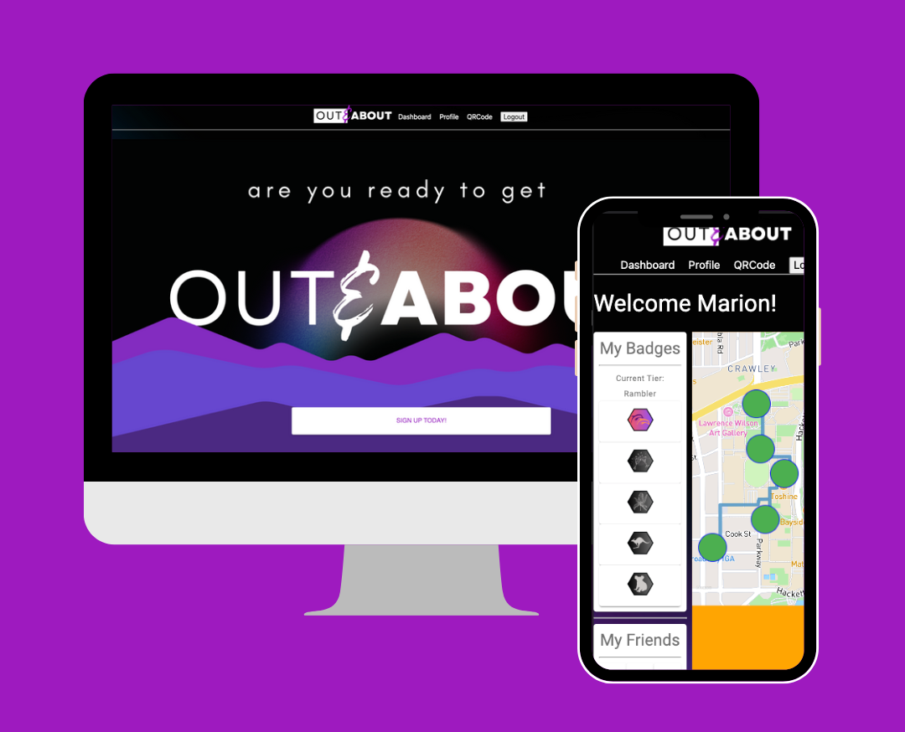
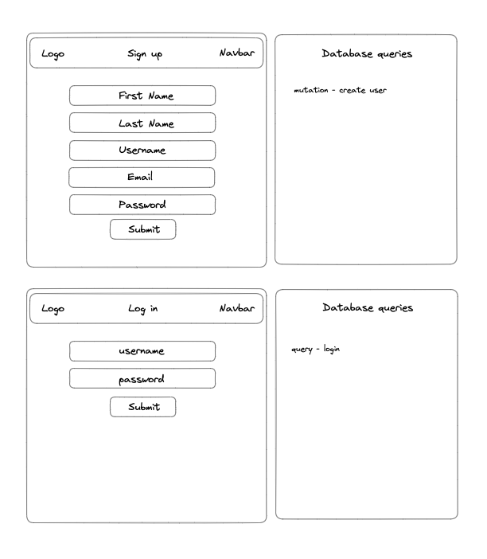
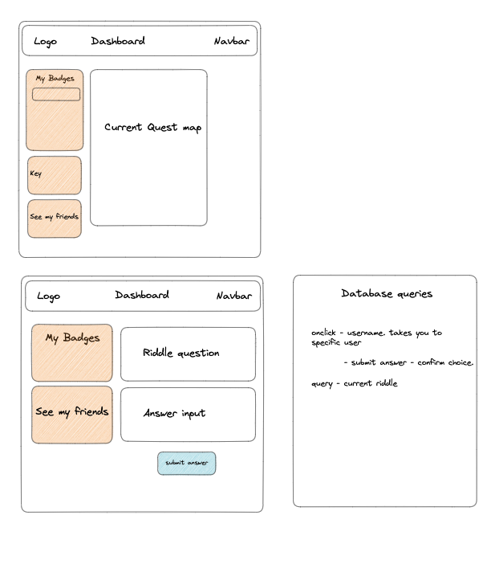
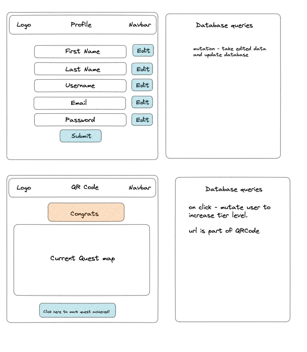

# Out and About

---

It is time to go on a Quest, it is time to get out and about!

---

                    

---

[About](#about) ✦ [Deployment](#deployment) ✦ [Technologies Used](#technologies-used) ✦ [Wire Frame](#wire-frame) ✦ [Future Developments](#future-developments) ✦ [Credits](#credits)✦ [Resources](#resources) ✦ [License](#license) ✦ [Contact](#contact)

---

## About

Are you tired of walking alone and want to add some excitement to your daily routine? With the new "Out and About" app you can now get outside and explore your city!!! Complete quests, solve riddles, and earn rewards while making new friends along the way. With "Out and About," you'll never have to walk alone and feel bored again. So, what are you waiting for? Download "Out and About" now and join into this new adventure with us!

## Deployment

This application is deployed using Heroku. Please follow the link below.

https://outnabout.herokuapp.com/

## Technologies Used

There is a large range of technologies used for this application.

- Apollo/GraphQL - used to create the graphql server
- GitHub Actions - used to Get code from repo, install nodeJS and build the app.
- JWT- used to authenitcate the user login
- MapBox API - used to render all map components of the application.
- Material UI - we have used this React libeary for our react components.
- MongoDB/Mongoose - used to create the database and schema.
- React - used to create the application ecosystem.

## Wire Frame

The images below show our inititial wireframes and database queries for our application.

## Future Developments

What is next for Out and About?

This project has lots of dreams and next steps. Here are a few of the biggest and brightest ideas.

1. Add Friends - We would like this to be a social experience. We want out users to be able to add friends and go on quests together.
2. More Quests - We would like to create multiple quests for users to go on per tier. That way users get to exmplore more.
3. Augmented Reality - Out and About currently relies on physical qr codes on the route. We would love to develop the use of AR to allow our users to get the qr codes based on location.

## License

This project is using the following license:

**MIT**

For further information regarding the license, please follow the link below:
https://opensource.org/licenses/MIT

---

## Contact

If you have any further questions, please contact via email or github.

| Steph:                                                                                                                                                                                                                                                                                                                                                                           | Joao:                                                                                                                                                                                                                                                                                                                                                                       | Harry:                                                                                                                                                                                                                                                                                                                                                                        | Caoimhe:                                                                                                                                                                                                                                                                                                                                                                         |
| -------------------------------------------------------------------------------------------------------------------------------------------------------------------------------------------------------------------------------------------------------------------------------------------------------------------------------------------------------------------------------- | --------------------------------------------------------------------------------------------------------------------------------------------------------------------------------------------------------------------------------------------------------------------------------------------------------------------------------------------------------------------------- | ----------------------------------------------------------------------------------------------------------------------------------------------------------------------------------------------------------------------------------------------------------------------------------------------------------------------------------------------------------------------------- | -------------------------------------------------------------------------------------------------------------------------------------------------------------------------------------------------------------------------------------------------------------------------------------------------------------------------------------------------------------------------------- |
|  |  |  |   |
